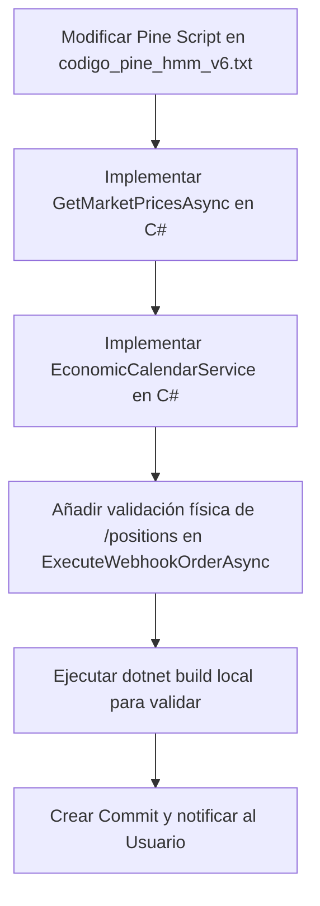

# Plan de Implementación: Resolución de Vulnerabilidades Críticas

Este plan detalla los pasos técnicos para migrar la inteligencia de validación real (spreads dinámicos, noticias macro y control de posiciones abiertas) desde TradingView (Pine Script) hacia el backend en C# (microservicio .NET), dejando a TradingView como un radar puramente estadístico y eliminando vulnerabilidades críticas en producción.

---

## 1. Modificaciones en Pine Script (TradingView)

El script de TradingView quedará libre de parámetros de mercado real e inputs inmantanibles.

### A. Eliminación del Spread Estático
* **Eliminar parámetro**: Se removerá la constante hardcodeada `estimated_spread = 1.5` de la cabecera.
* **Simplificar distancias**: La distancia de Stop Loss se calculará puramente según niveles estructurales:
  ```pinescript
  sl_dist_pips = sl_dist / pip_size
  ```
  *(Sin añadir el spread estático en el gráfico).*
* **Ajuste de Break-Even**: El precio de Break-Even usará una constante local de buffer (ej. `1.5 * pip_size`) solo para cubrir costos mínimos del simulador, indicando claramente que es un buffer operacional interno y no una aproximación del spread real.

### B. Eliminación del Filtro de Noticias Macro Hardcodeado
* **Remover parámetros**: Se borrarán todos los inputs de fechas y horas (`news1_start`, `news1_end`, etc.), así como las variables de control `enable_news_filter` e `in_news_blackout`.
* **Ajustar lógica de entrada**: La variable `allowed_to_enter` se simplificará, removiendo la restricción de noticias.
* **Limpiar telemetría visual**: Se removerá el estado de noticias de la tabla de auditoría del gráfico y de los logs visuales.

### C. Eliminación de Dependencia del Simulador (`strategy.opentrades == 0`)
* **Remover filtros**: Se eliminará la condición `strategy.opentrades == 0` de las rupturas Darvas y de la autorización de entrada (`allowed_to_enter`).
* **Objetivo**: Permitir que TradingView coloque órdenes límite virtuales y dispare señales cada vez que el radar matemático (HMM) y estructural (Darvas Box) detecten una ruptura, delegando el control de doble exposición al backend.

---

## 2. Modificaciones en el Backend (C# / .NET)

El microservicio en C# asumirá toda la inteligencia y validación del mercado real en tiempo real.

### A. Validación de Spread Dinámico
* **Nueva consulta API**: Implementar un método `GetMarketPricesAsync` en `CapitalComService.cs` que llame al endpoint `GET /markets/{epic}` de Capital.com para obtener el Bid y Ask vigentes en el milisegundo exacto de recibir el webhook.
* **Cálculo en vivo**: 
  ```csharp
  var spread = Math.Abs(offer - bid);
  var spreadInPips = spread / pipSize;
  ```
* **Filtro preventivo**: Si `spreadInPips > MaxSpreadPips` (ej. `3.0` pips para EURUSD/GBPUSD), se rechazará la entrada para evitar la ejecución en condiciones de spreads violentamente ensanchados, retornando un código de éxito con diagnóstico de rechazo.

### B. Módulo de Calendario Económico Autónomo
* **Nuevo Servicio de Noticias (`EconomicCalendarService`)**:
  * Se creará una clase de servicio que consulte diariamente de forma gratuita un feed JSON público de calendario económico (ej. DailyFX o Investing.com).
  * El servicio almacenará los eventos macro de alto impacto en caché/memoria.
  * Al recibir un webhook, el backend llamará a `calendarService.IsNearHighImpactNews(symbol, DateTime.UtcNow)`. Si hay un evento clasificado como "High Impact" para las divisas del par operado en una ventana de +/- 15 minutos, el backend ignorará el webhook de forma preventiva.

### C. Validación de Posiciones Reales en Broker (Idempotencia Física)
* **Consulta en vivo de posiciones**: Antes de colocar cualquier orden bracket (OCO) en Capital.com, `ExecuteWebhookOrderAsync` consultará el endpoint `/positions` del broker.
* **Bloqueo físico**: Si el broker confirma que ya existe una posición abierta para ese `symbol` / `EPIC`, el backend rechazará preventivamente la orden con un mensaje diagnóstico de sobreexposición, asegurando protección total ante desincronizaciones de la base de datos o el simulador.

---

## 3. Impacto en la Estructura de Datos (JSON)

* El contrato de integración detallado en la sección 9 de la documentación cambiará ligeramente:
  * El campo `lot_size` y `action` seguirán el nuevo contrato (valores admitidos: `"BUY"`, `"SELL"`, `"CLOSE"`).
  * El backend recalculará el lotaje físico final utilizando la distancia al Stop Loss estructural puro y el saldo líquido real de la cuenta.

---

## 4. Plan de Acción y Despliegue en Fases



### Pruebas de Validación
* **Compilación**: Asegurar `0 warnings` y `0 errores`.
* **Prueba de Webhook**: Simular el envío de un webhook de apertura sobre un activo que ya tiene una posición real abierta en la cuenta demo de Capital.com y verificar que es rechazado de forma segura.
* **Prueba de Spread**: Simular spread ensanchado y verificar rechazo.
